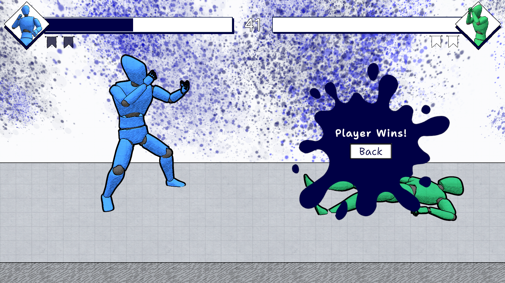
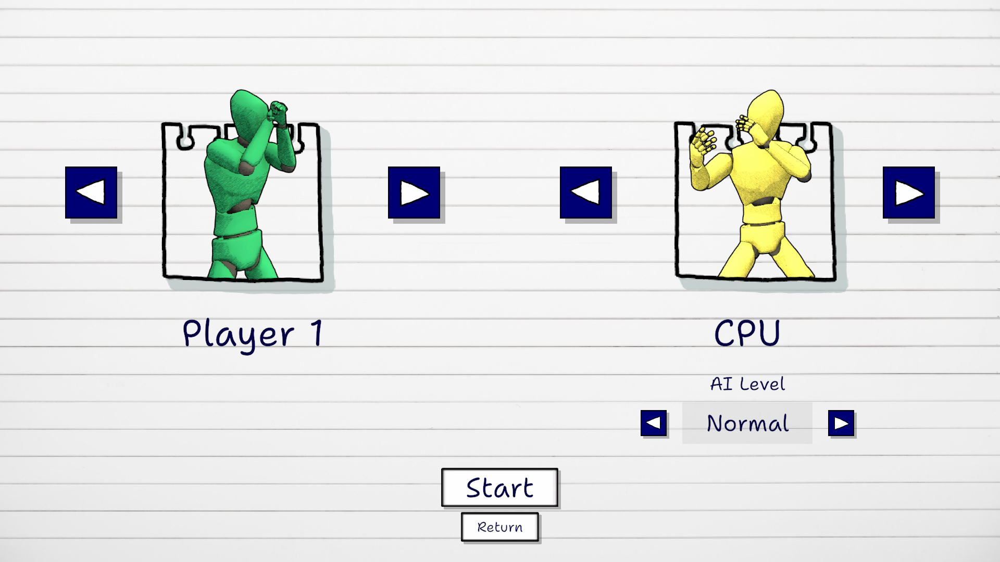

# Ink Fights

**Fighting Game with Q-Learning AI**

**Ink Fights** is a fighting game developed as my engineering thesis project. Beyond the core combat mechanics, the primary technical achievement of this project is implementation of a reinforcement learning algorithm (Q-Learning) to train the AI opponents.

---

## About

The game features classic fighting mechanics tailored for quick and engaging matches:
* **Game Modes:** 1 vs 1 (local) and Player vs AI.
* **Customization:** Players can choose their character's ink color before jumping into the fray.
* **Match Format:** Matches are played in a "Best of 3" format.

  
*Character customization*

  
*Gameplay*

Upon the conclusion of a fight, a results screen is displayed, allowing players to review the match outcome and seamlessly return to the main menu for the next battle.

  
*Post-match results screen*

---

## AI Architecture (Q-Learning)

The opponent's Artificial Intelligence was built using a modular, cross-engine approach:
* **Q-Learning Algorithm:** Fully implemented in **Python**. The model was trained in a local environment.
* **Network Communication:** Unity communicated with the Python algorithm via WebSockets, continuously sending environment states and receiving combat decisions in real-time during training.
* **Implementation:** The trained agent's model is exported as a `JSON` file. A dedicated manager in Unity parses this data to manage and execute the AI opponent's behaviors at runtime.
* **Difficulty Profiles:** Two distinct AI profiles were successfully trained – **Normal** and **Aggressive** – which the player can select before starting a Player vs AI match.

---

## Art Style

The visual identity of "Ink Fights" is heavily inspired by sketchbooks, notes, and vivid ink colors. This aesthetic was achieved through custom rendering techniques:
* **Cel Shading:** Shadows on characters and environments are rendered using a modified cel-shader to provide a comic-book feel.
* **Outlines:** Two distinct outline shaders were developed and applied to generate object contours, emphasizing the hand-drawn, sketch-like atmosphere.
* **Aesthetic:** A bright, high-contrast color palette highlighted by intense, ink-like accent colors.